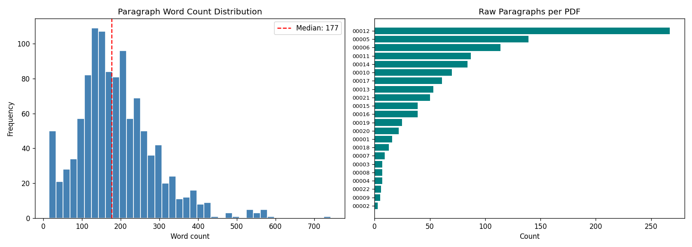
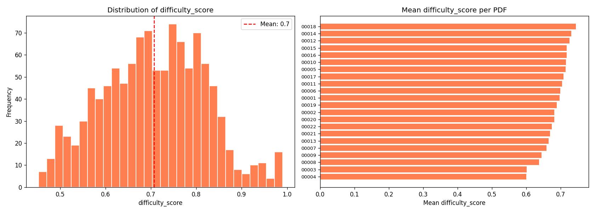

# Q21G — Competitive 21 Questions AI Game

[](https://github.com/TalHibner/q21g-project/actions/workflows/ci.yml)

Two AI agents play "21 Questions" over Gmail using Hebrew academic course PDFs as the knowledge base. A **Referee** picks a secret paragraph and gives hints; a **Player** asks 20 strategic questions then guesses the opening sentence.

## Architecture

```
                         Gmail (OAuth)
                      /                \
              Referee Agent           Player Agent
              (RLGMRunner)            (run.py --watch)
                   |                       |
            4 Callbacks               4 Callbacks
            (my_ai.py)               (my_player.py)
                   |                       |
          +--------+--------+     +--------+--------+
          |        |        |     |        |        |
       Hint Gen  Answer  Score  Search  Questions  Guess
          |      Questions  |     |                  |
          +--------+--------+     +--------+--------+
                   |                       |
            Claude Sonnet API        Claude Sonnet API
            (via llm_client.py)      (via llm_client.py)
                   |                       |
                   +----------+------------+
                              |
                      Knowledge Base (shared)
                     /        |         \
               SQLite    ChromaDB    Paragraph
             (lookups)  (semantic    Filter
                         search)
                              |
                   sentence-transformers
              (paraphrase-multilingual-MiniLM-L12-v2)
```

## Game Flow

```
Round Start
    |
    v
[Referee] select paragraph from KB --> generate hint (no taboo words) --> send to player
    |
    v
[Player] semantic search KB with hint --> find 20 candidates --> generate 20 questions
    |
    v
[Referee] answer 20 questions (A/B/C/D/Not Relevant) based on secret paragraph
    |
    v
[Player] re-rank candidates using Q&A evidence --> guess opening sentence + association word
    |
    v
[Referee] score guess (0-100 weighted) --> assign league points (3/2/1/0)
```

## Project Structure

```
q21g-project/
├── skills/                      # 6 LLM prompt templates
│   ├── referee_hint_generator.md
│   ├── referee_question_answerer.md
│   ├── referee_scorer.md
│   ├── player_question_generator.md
│   ├── player_guess_maker.md
│   └── warmup_solver.md
│
├── knowledge_base/              # Shared RAG infrastructure (pip install -e)
│   ├── corpus_builder.py        # PDF -> paragraphs.json
│   ├── sentence_extractor.py    # Hebrew first-sentence extraction
│   ├── paragraph_filter.py      # Quality filter (formulas, code, noise)
│   ├── db.py                    # SQLite (ParagraphDB)
│   ├── vector_store.py          # ChromaDB (VectorStore)
│   ├── difficulty_indexer.py    # Paragraph difficulty scoring
│   ├── llm_client.py           # Shared Claude API client with retry
│   ├── skill_plugin.py          # Plugin system: SkillPlugin, SkillRegistry
│   └── data/                    # Built locally (gitignored)
│
├── Q21G-referee-whl/            # Referee SDK + our implementation
│   ├── src/q21_referee/         # SDK internals (don't modify)
│   ├── examples/
│   │   ├── my_ai.py            # <-- Our referee (4 callbacks)
│   │   ├── referee_helpers.py   # Hint gen, question answering
│   │   ├── referee_scoring.py   # Scoring with string pre-check
│   │   └── main.py             # Production entry point
│   └── config.json              # Gmail OAuth + group config
│
├── Q21G-player-whl/             # Player SDK + our implementation
│   ├── _infra/                  # SDK internals (don't modify)
│   ├── my_player.py            # <-- Our player (4 callbacks)
│   ├── player_helpers.py        # Search, question generation
│   ├── player_guess.py          # Re-ranking, guess with Q&A citations
│   ├── run.py                   # Production entry point
│   └── js/config.json           # Player config
│
├── tests/                       # 94 tests
│   ├── test_knowledge_base.py
│   ├── test_referee.py
│   ├── test_player.py
│   ├── test_game_simulation.py  # End-to-end referee <-> player
│   ├── test_live_simulation.py
│   └── test_skill_plugin.py     # Plugin architecture tests
│
├── docs/
│   ├── ARCHITECTURE.md          # C4 diagrams, sequence diagram, ADR index
│   ├── BUDGET.md                # API cost estimates & spending tracker
│   ├── PROMPT_ENGINEERING_LOG.md # Iterative prompt development history
│   └── adr/                     # Architecture Decision Records (5 ADRs)
│
├── .github/workflows/ci.yml     # GitHub Actions CI
├── .pre-commit-config.yaml      # Pre-commit hooks (ruff lint + format)
├── .env.example                 # Environment variables template
├── requirements.txt             # Runtime dependencies
├── requirements-dev.txt         # Development/test dependencies
├── LICENSE                      # MIT License
└── course_pdfs/                 # 22 Hebrew academic PDFs (gitignored)
```

## Setup

### Prerequisites

- Python 3.11+
- [uv](https://docs.astral.sh/uv/) package manager (recommended)
- Gmail OAuth credentials for both agents
- Anthropic API key

### Installation

```bash
git clone https://github.com/TalHibner/q21g-project.git
cd q21g-project

# Create virtual environment
python3 -m venv .venv
source .venv/bin/activate

# Install SDKs and knowledge base
pip install -e Q21G-referee-whl/
pip install -e Q21G-player-whl/
pip install -e knowledge_base/
pip install anthropic
```

### Environment Variables

Create `.env` in the project root:

```
ANTHROPIC_API_KEY=sk-ant-...
HF_TOKEN=hf_...
```

### Build Knowledge Base

```bash
# 1. Place 22 Hebrew PDFs in course_pdfs/

# 2. Build the corpus
python -m knowledge_base.corpus_builder

# 3. Build SQLite + ChromaDB
python -c "
from knowledge_base.corpus_builder import build_corpus
from knowledge_base.db import build_sqlite
from knowledge_base.vector_store import build_chroma
from pathlib import Path
import json

data_dir = Path('knowledge_base/data')
with open(data_dir / 'paragraphs.json') as f:
    paras = json.load(f)['paragraphs']

build_sqlite(paras, data_dir / 'paragraphs.db')
build_chroma(paras, data_dir / 'chroma_db')
"

# 4. Compute difficulty scores
python -m knowledge_base.difficulty_indexer

# 5. Verify
python -c "
from knowledge_base.db import ParagraphDB
from knowledge_base.vector_store import VectorStore
db = ParagraphDB(); vs = VectorStore()
print(f'SQLite: {db.count()} paragraphs')
print(f'ChromaDB: {vs.count()} vectors')
"
```

### Gmail OAuth

Both agents need OAuth tokens. Follow the SDK setup guides:

```bash
# Referee
cd Q21G-referee-whl && python authenticate.py

# Player
cd Q21G-player-whl && python setup_gmail.py
```

## Running

### Referee (Production)

```bash
cd Q21G-referee-whl/examples
source ../../.venv/bin/activate
python main.py
```

Or with uv:

```bash
cd Q21G-referee-whl/examples
/home/hibta/.local/bin/uv run python main.py
```

### Player (Production)

```bash
cd Q21G-player-whl
source ../.venv/bin/activate
python run.py --watch
```

## Development

### Pre-commit hooks

```bash
pip install pre-commit
pre-commit install       # installs hooks into .git/hooks/pre-commit
pre-commit run --all-files   # run manually on all files
```

Hooks run automatically on `git commit` and enforce:
- **ruff** — linting with auto-fix
- **ruff-format** — consistent code formatting
- Standard checks: YAML/TOML validity, merge conflicts, debug statements

### Continuous Integration

Every push and pull request to `main` runs the full CI pipeline via GitHub Actions (`.github/workflows/ci.yml`):
1. Installs all dependencies
2. Runs all pre-commit hooks
3. Runs `pytest` with coverage across all three packages

Tests that require the pre-built knowledge base (SQLite/ChromaDB data) are automatically skipped in CI — they are marked with `pytest.skip` when the data files are absent.

### Skill Plugin Architecture

Skills are LLM prompt templates in `skills/*.md`. The plugin system in `knowledge_base/skill_plugin.py` makes them modular and swappable:

```python
from knowledge_base.skill_plugin import SkillRegistry, MarkdownSkillPlugin, build_default_registry

# Build registry with all 6 built-in skills
registry = build_default_registry(SKILLS_DIR)

# Retrieve a skill prompt
prompt = registry.get("referee_hint_generator.md").get_prompt()

# Swap a skill at runtime (e.g., for A/B testing or mocking in tests)
registry.register(MyFewShotHintPlugin())
```

To add a custom skill backend, subclass `SkillPlugin` and implement `name` and `get_prompt(context)`. Register it with any `SkillRegistry` instance.

### API Cost

Running one game (referee + player) costs approximately **$0.09** in Claude API usage.
A full tournament season (10 rounds) is projected at **~$0.88**.
See [`docs/BUDGET.md`](docs/BUDGET.md) for the full breakdown by callback, token estimates, and a tracker for actual spending.

### Running Tests

```bash
source .venv/bin/activate
pytest tests/ -v              # All 94 tests
pytest tests/test_referee.py  # Referee only
pytest tests/test_player.py   # Player only
pytest tests/test_skill_plugin.py  # Plugin architecture only
```

---

## Scoring

Each guess is scored on 4 components (0-100 each):

| Component | Weight | What's Measured |
|---|---|---|
| Opening sentence | 50% | Exact match of guessed vs actual opening sentence |
| Sentence justification | 20% | Quality of reasoning, must cite 3+ Q&A pairs |
| Association word | 20% | Match between guessed and actual association word |
| Word justification | 10% | Quality of reasoning, must cite 2+ Q&A pairs |

**Private score** = weighted sum (0-100)

**League points**: 85-100 = 3 pts, 70-84 = 2 pts, 50-69 = 1 pt, 0-49 = 0 pts

## Key Optimizations

- **Dual search**: PDF-filtered results get priority, unfiltered fill remaining slots
- **Hint self-test**: Referee verifies ChromaDB can find the paragraph using the generated hint
- **Taboo word validation**: Hint must not share any word with the paragraph text
- **Candidate shuffling**: Removes LLM position bias in guess-making
- **Sentence lookup**: Opening sentence is read from stored candidate data, never copied by LLM
- **String pre-check**: `SequenceMatcher` overrides LLM scoring for obvious matches (>=95% = 98 pts)
- **Paragraph filter**: Rejects formulas, code, noise — 1123 raw -> 340 valid paragraphs
- **LLM retry**: 2x retry with exponential backoff on timeout/rate-limit/connection errors

## Contributing

1. **Fork & branch** — create a feature branch from `main`:
   ```bash
   git checkout -b feature/your-feature-name
   ```
2. **Code style** — run `pre-commit run --all-files` before committing (ruff lint + format).
3. **Tests** — add tests for new code, keep coverage ≥70%:
   ```bash
   pytest tests/ --cov=knowledge_base --cov-report=term-missing
   ```
4. **Commit messages** — use semantic prefixes: `feat:`, `fix:`, `docs:`, `test:`, `refactor:`.
5. **Pull Request** — target `main`, describe the change and link related issues.
6. **Skill plugins** — to add a new AI behavior, subclass `SkillPlugin` in `knowledge_base/skill_plugin.py` and register it with `SkillRegistry`. See `skills/` for the 6 built-in prompt templates.

## Screenshots

### Game Round Output

*Screenshots of a live game round showing referee hint generation, player question asking, and final scoring.*


<br>

<br>

<br>

<br>

<br>

<br>

<br>

<br>

<br>

<br>

<br>

<br>

<br>

<br>

<br>

<br>

<br>

<br>

<br>


### Knowledge Base Statistics




## Tech Stack

| Component | Technology |
|---|---|
| LLM | Claude Sonnet (claude-sonnet-4-20250514) |
| Embeddings | paraphrase-multilingual-MiniLM-L12-v2 |
| Vector Store | ChromaDB (cosine distance) |
| Database | SQLite3 |
| PDF Extraction | pdfplumber |
| Communication | Gmail API (OAuth) |
| Language | Python 3.11+ |

## Troubleshooting

### `pip install` fails with "externally managed environment"

PEP 668 blocks system-level installs. Always activate the venv first:

```bash
source .venv/bin/activate
pip install -e Q21G-referee-whl/
```

### `ModuleNotFoundError: No module named 'knowledge_base'`

The package isn't installed in the active venv:

```bash
source .venv/bin/activate
pip install -e knowledge_base/
```

### ChromaDB build fails with `sqlite3` version error

ChromaDB requires SQLite ≥ 3.35. On older systems:

```bash
pip install pysqlite3-binary
# Then in your script, before importing chromadb:
# import sys, pysqlite3; sys.modules["sqlite3"] = pysqlite3
```

### `sentence-transformers` model download hangs / fails

Set your Hugging Face token and check connectivity:

```bash
export HF_TOKEN=hf_...
# Or pre-download the model:
python -c "from sentence_transformers import SentenceTransformer; SentenceTransformer('paraphrase-multilingual-MiniLM-L12-v2')"
```

### Gmail OAuth `invalid_grant` error

The OAuth token has expired. Delete the token file and re-authenticate:

```bash
# Referee
rm Q21G-referee-whl/token.json
cd Q21G-referee-whl && python authenticate.py

# Player
rm Q21G-player-whl/token.json
cd Q21G-player-whl && python setup_gmail.py
```

### LLM call times out (referee callback exceeds 120 s)

All 20 questions must be answered in **one** LLM call. If you see per-question calls in `referee_helpers.py`, that's the bug. Batch the full question list into a single prompt.

### Hebrew text displays as `(cid:NNN)` in extracted paragraphs

The PDF is image-based (scanned). The 22 course PDFs are text-based, so this shouldn't happen. If it does, the paragraph filter will reject those paragraphs automatically (`(cid:` is a disqualifier).

### `pytest` shows `0%` coverage

Install `pytest-cov` and run from the project root:

```bash
pip install pytest-cov
pytest tests/ -v
```

Coverage config is in `pyproject.toml`; HTML report lands in `htmlcov/`.

### `VectorStore.search()` returns wrong PDF's paragraphs

The dual-search priority logic requires PDF-filtered results to fill priority slots. If unfiltered results dominate, check `player_helpers.py` — the merge must fill slots from filtered results first, then backfill with unfiltered.

